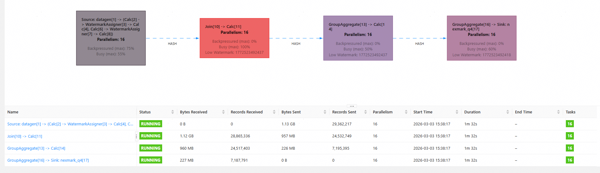
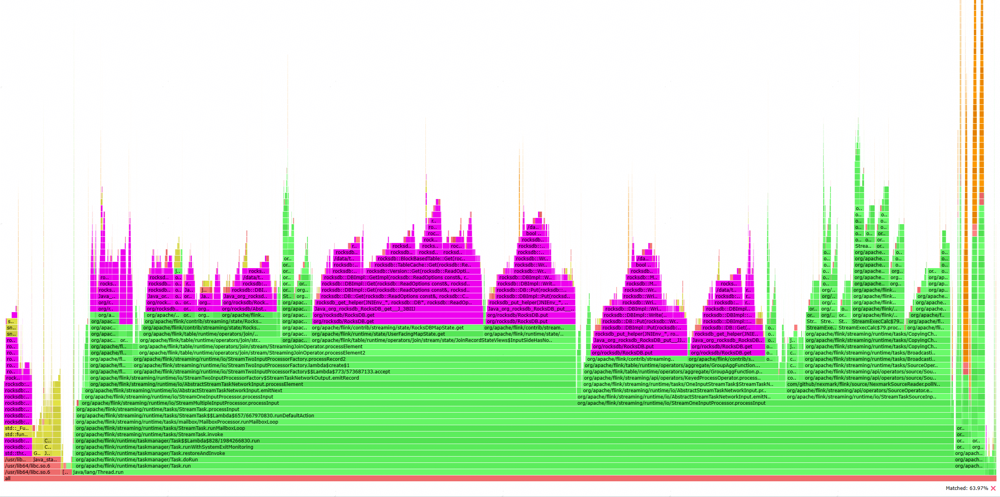

# OmniStateStore最佳实践
<font size=3>提供OmniStateStore的最佳实践样例，用户可以参阅本文档提供的实践样例，快速熟悉OmniStateStore的使用场景和加速效果。</font>

---
## 运行环境
<font size=3>

本实施例在鲲鹏920系列服务器上验证OmniStateStore的加速效果，任务运行的硬件和软件信息如下表所示：<br>

**表1** 实施例运行硬件和软件配置
<table>
  <thead>
    <tr>
      <th style="text-align: left;">项目</th>
      <th style="text-align: left;">版本</th>
    </tr>
  </thead>
  <tbody>
    <tr>
      <td style="text-align: left;">处理器</td>
      <td style="text-align: left;">Kunpeng 920系列服务器</td>
    </tr>
    <tr>
      <td style="text-align: left;">磁盘</td>
      <td style="text-align: left;">NVME SSD</td>
    </tr>
    <tr>
      <td style="text-align: left;">OS</td>
      <td style="text-align: left;">openEuler 22.03 LTS SP3</td>
    </tr>
    <tr>
      <td style="text-align: left;">内核</td>
      <td style="text-align: left;">5.10.0182.0.0.95.oe2203sp3.aarch64</td>
    </tr>
    <tr>
      <td style="text-align: left;">GCC</td>
      <td style="text-align: left;">10.3.1</td>
    </tr>
    <tr>
      <td style="text-align: left;">JDK</td>
      <td style="text-align: left;">毕昇JDK 1.8.0_432</td>
    </tr>
    <tr>
      <td style="text-align: left;">Maven</td>
      <td style="text-align: left;">Apache Maven 3.6.3</td>
    </tr>
    <tr>
      <td style="text-align: left;">Flink</td>
      <td style="text-align: left;">1.16.3</td>
    </tr>
    <tr>
      <td style="text-align: left;">FRocksDB</td>
      <td style="text-align: left;">6.20.3</td>
    </tr>
    <tr>
      <td style="text-align: left;">Nexmark</td>
      <td style="text-align: left;">0.3</td>
    </tr>
  </tbody>
</table>
</font>

---
## Flink部署方式
<font size=3>
本实施例使用容器化方式部署Flink集群。具体地，本实施例创建一个JobManager容器和两个TaskManager容器，容器配置均为8C32GB。其中每个TaskManager容器中部署4个TaskManager，每个TaskManager部署2个Slot。JobManager和TaskManager都分配8GB内存。<br>
实施例使用的Flink配置如下：<br>

```
taskmanager.memory.process.size: 8G
jobmanager.rpc.address: 172.19.0.2
jobmanager.rpc.port: 6123
jobmanager.memory.process.size: 8G
taskmanager.numberOfTaskSlots: 2
parallelism.default: 16
io.tmp.dirs: /data/tmp

state.backend: rocksdb
state.backend.rocksdb.localdir: /data/rocksdb
state.backend.incremental: true
```
</font>

---
## 测试用例
<font size=3>

本实施例基于nexmark0.3-Q4用例完成测试，其中Nexmark的获取方式请参阅[下载链接](https://github.com/nexmark/nexmark/releases/tag/v0.2.0)，使用方式请参阅[使用说明](#nexmark使用说明)。<br>
该用例执行的操作是双流Join + AGG, 用例运行情况如下图所示：<br>

**表1** nexmark q4 用例运行示意图

<a href="./figures/Nexmark任务运行网页截图.png"></a>


双流Join操作主要使用RocksDBMapState，AGG操作主要使用RocksDBValueState。通过采集火焰图信息，可以观测到该用例RocksDB占比超过60%，是该用例的主要性能瓶颈。火焰图信息如下图所示：

**表2** nexmark q4 用例CPU火焰图

<a href="./figures/Nexmark任务火焰图.png"></a>

为了创建足够数量的状态以验证omniStateStore的加速效果，本实施例使用1亿数据量运行nexmark。Nexmark的配置文件样例请参阅[nexmark.yaml](#nexmark使用说明)。

</font>

---
## OmniStateStore实践
<font size=3>

本实施例按照[OmniStateStore安装指南](installation_guide.md)和[OmniStateStore使用指南](user_guide.md)完成OmniStateStore的安装和使能，在Flink日志中观察到以下日志信息，表示OmniStateStore使能成功。

```
2026-03-03 16:00:52,972 INFO  org.apache.flink.runtime.taskexecutor.TaskExecutor           [] - [FALCON] configuring falcon cache heap memory management system. current TM have 2 slots, so each slot can cache 10000 states.
2026-03-03 16:00:53,057 INFO  org.apache.flink.runtime.taskexecutor.TaskExecutor           [] - [FALCON] configuring falcon cache heap memory management system. current TM have 2 slots, so each slot can cache 10000 states.
2026-03-03 16:00:53,068 INFO  org.apache.flink.runtime.taskexecutor.TaskExecutor           [] - [FALCON] configuring falcon cache heap memory management system. current TM have 2 slots, so each slot can cache 10000 states.
2026-03-03 16:00:53,200 INFO  org.apache.flink.runtime.taskexecutor.TaskExecutor           [] - [FALCON] configuring falcon cache heap memory management system. current TM have 2 slots, so each slot can cache 10000 states.
2026-03-03 16:00:53,219 INFO  org.apache.flink.runtime.taskexecutor.TaskExecutor           [] - [FALCON] configuring falcon cache heap memory management system. current TM have 2 slots, so each slot can cache 10000 states.
2026-03-03 16:00:53,252 INFO  org.apache.flink.runtime.taskexecutor.TaskExecutor           [] - [FALCON] configuring falcon cache heap memory management system. current TM have 2 slots, so each slot can cache 10000 states.
2026-03-03 16:00:53,317 INFO  org.apache.flink.runtime.taskexecutor.TaskExecutor           [] - [FALCON] configuring falcon cache heap memory management system. current TM have 2 slots, so each slot can cache 10000 states.
2026-03-03 16:00:53,364 INFO  org.apache.flink.runtime.taskexecutor.TaskExecutor           [] - [FALCON] configuring falcon cache heap memory management system. current TM have 2 slots, so each slot can cache 10000 states.
2026-03-03 16:00:54,202 INFO  org.apache.flink.optimizer.Optimizer                         [] - [FALCON] subTask 452769245d6eb1c1f65f53c5004299eb_14_0's slot have 4 subTasks, so each subTask can cache 2500 states.
2026-03-03 16:00:54,223 INFO  org.apache.flink.optimizer.Optimizer                         [] - [FALCON] subTask 29c6de9b0f6c5486908e9bb66a93ee45_14_0's slot have 4 subTasks, so each subTask can cache 2500 states.
2026-03-03 16:00:54,224 INFO  org.apache.flink.optimizer.Optimizer                         [] - [FALCON] subTask 452769245d6eb1c1f65f53c5004299eb_5_0's slot have 4 subTasks, so each subTask can cache 2500 states.
2026-03-03 16:00:54,228 INFO  org.apache.flink.optimizer.Optimizer                         [] - [FALCON] subTask 987497bfc681cca54be4ca4b6cce3386_5_0's slot have 4 subTasks, so each subTask can cache 2500 states.
2026-03-03 16:00:54,229 INFO  org.apache.flink.optimizer.Optimizer                         [] - [FALCON] subTask 29c6de9b0f6c5486908e9bb66a93ee45_5_0's slot have 4 subTasks, so each subTask can cache 2500 states.
2026-03-03 16:00:54,248 INFO  org.apache.flink.optimizer.Optimizer                         [] - [FALCON] subTask 987497bfc681cca54be4ca4b6cce3386_14_0's slot have 4 subTasks, so each subTask can cache 2500 states.
2026-03-03 16:00:54,642 INFO  org.apache.flink.table.runtime.operators.join.stream.state.JoinRecordStateViews [] - [FALCON] merge optimization is used for left-records.
2026-03-03 16:00:54,645 INFO  org.apache.flink.table.runtime.operators.join.stream.state.JoinRecordStateViews [] - [FALCON] merge optimization is used for left-records.
2026-03-03 16:00:54,678 INFO  com.huawei.falcon.state.RocksDBRuntimeOption                 [] - [FALCON] left-records is map, use range filter.
2026-03-03 16:00:54,682 INFO  com.huawei.falcon.state.RocksDBRuntimeOption                 [] - [FALCON] left-records is map, use range filter.
2026-03-03 16:00:54,691 INFO  com.huawei.falcon.state.RocksDBRuntimeOption                 [] - [FALCON] accState is valueState, use HashLinkList as memTable structure.
2026-03-03 16:00:54,703 INFO  com.huawei.falcon.state.RocksDBRuntimeOption                 [] - [FALCON] accState is valueState, use HashLinkList as memTable structure.
2026-03-03 16:00:54,705 INFO  com.huawei.falcon.state.RocksDBRuntimeOption                 [] - [FALCON] accState is valueState, use HashLinkList as memTable structure.
2026-03-03 16:00:54,709 INFO  org.apache.flink.table.runtime.operators.join.stream.state.JoinRecordStateViews [] - [FALCON] merge optimization is used for right-records.
2026-03-03 16:00:54,712 INFO  com.huawei.falcon.state.RocksDBRuntimeOption                 [] - [FALCON] right-records is map, use range filter.
2026-03-03 16:00:54,713 INFO  org.apache.flink.table.runtime.operators.join.stream.state.JoinRecordStateViews [] - [FALCON] merge optimization is used for right-records.
2026-03-03 16:00:54,715 INFO  com.huawei.falcon.state.RocksDBRuntimeOption                 [] - [FALCON] right-records is map, use range filter.
2026-03-03 16:00:54,726 INFO  org.apache.flink.streaming.api.operators.AbstractStreamOperator [] - [FALCON] enable miniBatch process for StreamingJoinOperator.
2026-03-03 16:00:54,730 INFO  org.apache.flink.streaming.api.operators.AbstractStreamOperator [] - [FALCON] enable miniBatch process for StreamingJoinOperator.
2026-03-03 16:00:54,830 INFO  com.huawei.falcon.state.RocksDBRuntimeOption                 [] - [FALCON] accState is valueState, use HashLinkList as memTable structure.
2026-03-03 16:00:54,834 INFO  org.apache.flink.contrib.streaming.state.RocksDBKeyedStateBackend [] - [FALCON] <accState, VALUE> enable falcon cache, and update falcon cache size of each state to 2500.
2026-03-03 16:00:54,837 INFO  org.apache.flink.contrib.streaming.state.RocksDBKeyedStateBackend [] - [FALCON] <accState, VALUE> enable falcon cache, and update falcon cache size of each state to 2500.
2026-03-03 16:00:54,838 INFO  org.apache.flink.contrib.streaming.state.RocksDBKeyedStateBackend [] - [FALCON] <accState, VALUE> enable falcon cache, and update falcon cache size of each state to 2500.
2026-03-03 16:00:54,855 INFO  org.apache.flink.contrib.streaming.state.RocksDBKeyedStateBackend [] - [FALCON] <accState, VALUE> enable falcon cache, and update falcon cache size of each state to 2500.
```
使用原生Flink运行nexmark0.3-Q4用例，任务的单核吞吐量为20.52；使能OmniStateStore状态存储加速后，该任务的单核吞吐量上升至37.26。**若以单核吞吐量作为性能评价指标，OmniStateStore性能提升81.58%。**

</font>

---
## Nexmark使用说明
<font size=3>

**步骤1**&emsp;下载Nexmark软件包，下载链接为[Link](https://github.com/nexmark/nexmark/releases/tag/v0.2.0)。

**步骤2**&emsp;在环境上部署Nexmark软件包，以“/opt”目录为例：
```
cd /opt
unzip nexmark-flink.zip
rm -rf nexmark-flink.zip
mv nexmark-flink nexmark
```
**步骤3**&emsp;将Nexmark的JAR包部署到Flink的lib目录下：
```
cp -r /opt/nexmark/lib/nexmark-flink-0.2-SNAPSHOT.jar $FLINK_HOME/lib/
```
**步骤4**&emsp;修改nexmark的测试配置，即修改“/opt/nexmark/conf/nexmark.yaml”文件，配置样例如下：
```
# The metric reporter server host.
nexmark.metric.reporter.host: 172.19.0.2
# The metric reporter server port.
nexmark.metric.reporter.port: 9098

#==============================================================================
# Benchmark workload configuration (events.num)
#==============================================================================

nexmark.workload.suite.100m.events.num: 100000000
nexmark.workload.suite.100m.tps: 10000000
nexmark.workload.suite.100m.queries: "q0,q1,q2,q3,q4,q5,q7,q8,q9,q10,q11,q12,q13,q14,q15,q16,q17,q18,q19,q20,q21,q22"
nexmark.workload.suite.100m.queries.cep: "q0,q1,q2,q3"
nexmark.workload.suite.100m.warmup.duration: 120s
nexmark.workload.suite.100m.warmup.events.num: 50000000
nexmark.workload.suite.100m.warmup.tps: 10000000

#==============================================================================
# Benchmark workload configuration (tps, legacy mode)
# Without events.num and with monitor.duration
# NOTE: The numerical value of TPS is unstable
#==============================================================================

# When to monitor the metrics, default 3min after job is started
# nexmark.metric.monitor.delay: 3min
# How long to monitor the metrics, default 3min, i.e. monitor from 3min to 6min after job is started
# nexmark.metric.monitor.duration: 3min

# nexmark.workload.suite.10m.tps: 10000000
# nexmark.workload.suite.10m.queries: "q0,q1,q2,q3,q4,q5,q7,q8,q9,q10,q11,q12,q13,q14,q15,q16,q17,q18,q19,q20,q21,q22"

#==============================================================================
# Workload for data generation
#==============================================================================

nexmark.workload.suite.datagen.tps: 10000000
nexmark.workload.suite.datagen.queries: "insert_kafka"
nexmark.workload.suite.datagen.queries.cep: "insert_kafka"

#==============================================================================
# Flink REST
#==============================================================================

flink.rest.address: 172.19.0.2
flink.rest.port: 8081

#==============================================================================
# Kafka config
#==============================================================================

# kafka.bootstrap.servers: ***:9092

nexmark.metric.monitor.delay: 8s
```

**步骤5**&emsp;启动Flink集群，并运行Nexmark的指定用例。
```
cd $FLINK_HOME/bin && ./start-cluster.sh
cd /opt/nexmark/bin && ./setup_cluster.sh
./run_query.sh q4
./shutdown_cluster.sh
cd $FLINK_HOME/bin && ./stop-cluster.sh
```
</font>
