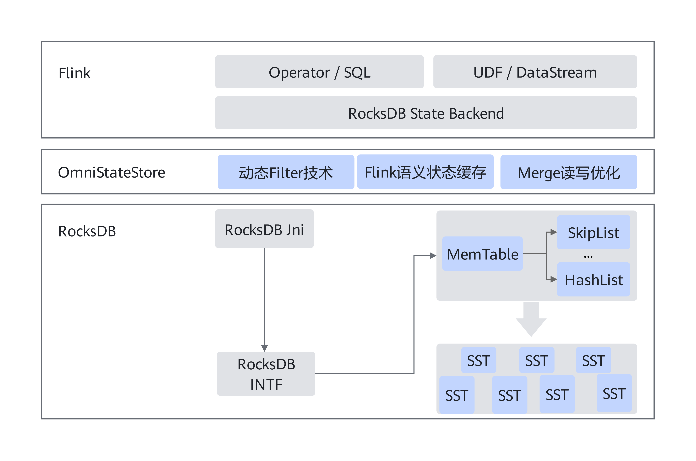
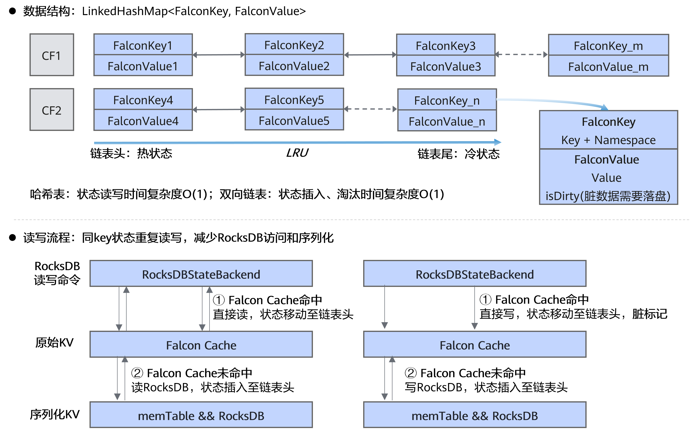
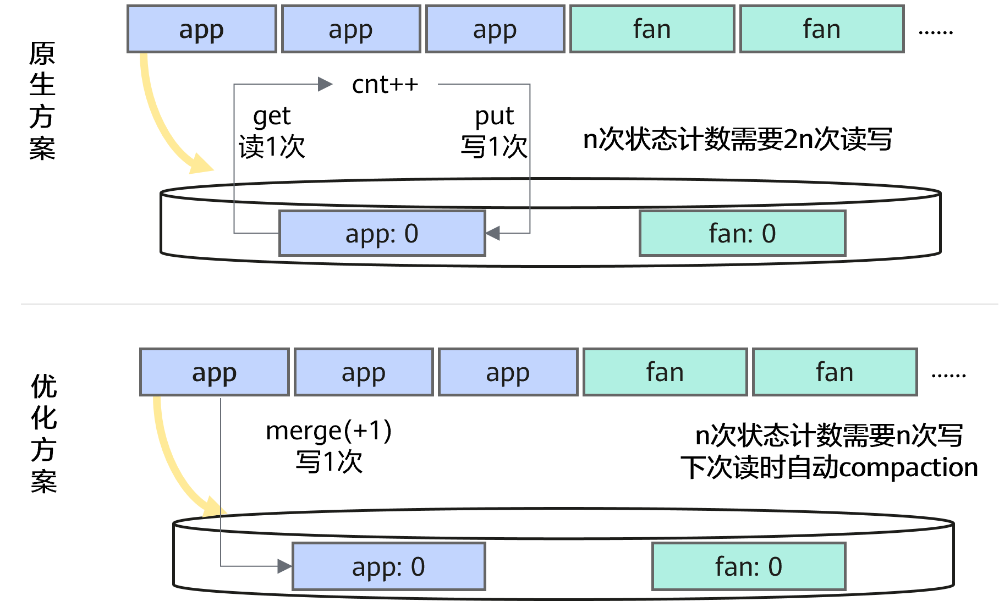

# 设计指南
 本文档提供OmniStateStore的设计指南，帮助用户快速熟悉OmniStateStore的系统架构以及加速特性。

---
## OmniStateStore系统架构

OmniStateStore北向对接Flink RocksDB State Backend接口层，南向对接RocksDB，通过在Flink侧进行轻量级修改，降低Flink对RocksDB的访问频次，提升有状态用例的端到端性能。 
OmniStateStore适用于Flink + RocksDB架构，作为Flink和RocksDB之间的中间层插件，适用于SQL或DataStream场景。系统架构图如下图所示：

**图1** OmniStateStore系统架构图

---
## OmniStateStore特性关键技术
### Flink智能多流感知算法

RocksDB的memTable提供了两种数据结构，一种是跳表，一种是哈希链表，且默认使用跳表作为memTable的数据结构。 
若状态操作类型包括点读、点写、范围查询等操作时，使用跳表是一个很好的选择，各操作都有较低的时间复杂度。但若状态只包含点读和点写操作，跳表的时间复杂度均为O(logn)，并非最优。 
因此，Flink智能多流感知算法的主要思想是：对于RocksDBValueState类型的状态，将其对应的memTable结构修改为哈希链表，以实现最低读写时间复杂度。

### 动态filter技术

**RocksDB的filter机制**

RocksDB通常使用block cache加速状态查询操作，其中一大核心机制是filter机制。即状态查询前，首先查询block cache中的filter，若filter判断状态不在RocksDB中，则不执行后续的磁盘查找操作。具体地，RocksDB提供以下两种类型的filter加速状态读操作，如下图所示： 
**- 使用bloom filter加速状态的点查操作 **
执行状态查询操作时，首先查询内存中的bloom filter。若filter返回true，则进一步从磁盘中读取对应的SSTable完成状态查询；若filter返回false，则表示当前SSTable中不包含相应的状态，因此不从磁盘中读取相应的SSTable。以下图为例，状态A的点查操作可以减少两次SSTable查询。 
**- 使用range filter加速状态的范围查询操作 **
执行状态范围查询操作时，首先提取待查询状态的key前缀，并查询内存中的range filter。若filter返回true，则表示以RocksDB中存在当前key前缀的状态，则进一步从磁盘中读取对应的SSTable完成范围查询；若filter返回false，则表示当前SSTable中不包含当前key前缀的状态，因此不从磁盘中读取相应的SSTable。以下图为例，以ABA为前缀的的范围操作可以减少两次SSTable查询。

**图2** Flink filter原理示意图

RocksDB提供的filter在Flink场景应用主要存在以下两个问题： 
**- 在随机读写场景下，使用bloom-filer可能导致系统性能严重下降。** 例如，在随机读写场景下，RocksDB的SSTable将频繁的进行compaction操作，从而导致内存的filter频繁失效。此时，需要频繁的根据SSTable创建新的filter。在nexmark0.2-Q15用例中，打开bloom-filter将导致filter miss率上升10X，进而导致系统性能下降10X。 
**- 当范围查询key的长度小于range-filter长度时，使用range-filter将导致查询结果错误。** 例如，若范围查询以AB为前缀的状态，而filter长度为3，此时将判定RocksDB中不存在AB为前缀的状态，进而造成误判，导致范围查询结果错误。

**动态filter技术** 
为了解决以上问题，OmniStateStore提出动态filter技术用于加速状态点查和范围查询操作。具体地，动态filter技术可以拆解为以下两个子特性： 
**- IO驱动的动态filter策略。 ** 在随机读写场景下，使用partition filter替换bloom filter完成状态读加速。bloom filter以SSTable的粒度构建filter，filter的IO成本较高；而partition filter以SSTable的block粒度构建filter，使得构建filter的IO操作更加轻量级。示意图如下图所示。 
**- 自适应range filter策略 ** 当数据集中key的长度不一致时，进行key长度的动态判断。当范围查询key的长度大于filter长度时，启用prefix优化；当范围查询key的长度小于filter长度时，禁用prefix优化。 

**图3** OmniStateStore partition filter原理示意图

## Flink语义状态缓存算法

**RocksDBValueState的状态读写机制 **
RocksDBVauleState是Flink中常用的一种状态，而状态在RocksDB中均以KV形式存储。其中，K包含任务指定的key和窗口信息namespace，V包含任务指定的value。

**Flink语义状态缓存算法 **
在Flink的业务负载中，RocksDBVauleState的K不是全局唯一的，而相同K的每次状态访问都需要和RocksDB交互，导致磁盘IO成为主要性能瓶颈。该算法的主要思想是：在内存中创建一块状态缓存，相同K的一批状态优先在缓存中完成聚合，从而减少同K状态对RocksDB的访问频次。由于缓存的大小有限，因此当缓存容量超过阈值时，使用LRU策略淘汰掉一条最久未被访问的状态并写入RocksDB。此外，为了维护数据一致性，每次checkpoint操作之前，先将缓存中的状态写入RocksDB。 
具体地，本算法使用LinkedHashMap作为状态缓存的数据结构，此时状态读、状态写、状态删除和状态淘汰操作时间复杂度均为O(1)。状态读、状态写、状态删除操作优先访问状态缓存，仅当缓存未命中时访问RocksDB。

**图4** Flink语义状态缓存算法原理示意图

### 双流Join数据缓存算法

**Flink的双流Join算子处理逻辑 **
对于Flink的StreamingJoinOperator，其Join流程包含以下几步：

- 从输入数据中提取join key。
- 依据join key，在对表的RocksDB中范围查询以join key为前缀的状态。
- 输入数据与范围查询结果依次完成join，并输出join结果。
- 根据输入数据，更新输入表的RocksDB。

**问题 **
在双流Join操作中，joinKey一般不是全局唯一的，此时相同joinKey的数据需要重复进行范围查询操作。对于输入表中连续到达的多条相同joinKey的数据，需要重复在对表RocksDB中进行范围查询操作，且查询结果完全一致。 
而状态的范围查询操作开销巨大，首先需要根据范围查询前缀在磁盘中进行二分查找，然后需要在磁盘中进行遍历，直到范围查询到所有相关状态。因此，在双流Join操作中，状态范围查询操作通常是主要性能瓶颈。

**OmniStateStore的双流Join算子处理逻辑 **
对于Flink的StreamingJoinOperator，OmniStateStore的Join流程包含以下几步：

- 从输入数据中提取join key，将数据插入到数据缓存中，并将数据按照join key聚合；当数据缓存容量超过阈值时，触发批量join操作。
- 对于相同join key的一批数据，依据join key，在对表的RocksDB中范围查询以join key为前缀的状态。
- 相同join key的一批数据与范围查询结果两两完成join，并输出join结果。
- 根据相同join key的一批数据，更新输入表的RocksDB。

### Merge读写优化

**问题 **
Flink的状态计数操作需多次读写RocksDB，例如在nexmark0.2-Q9用例中，状态技术操作的CPU占比高达20%。

**OmniStateStore的merge优化原理 **
Merge优化的原理图如下图所示。其主要原理是，使用rocksdb的merge接口替换状态更新的读写操作，将写入状态值修改为写入状态累加操作。通过这种方式，可以将一次状态读一次状态写缩减为一次状态写。当状态被第二次读时，或是触发compaction操作时，在后台触发状态的实际合并操作。 

**图5** Merge读写优化算法原理示意图

