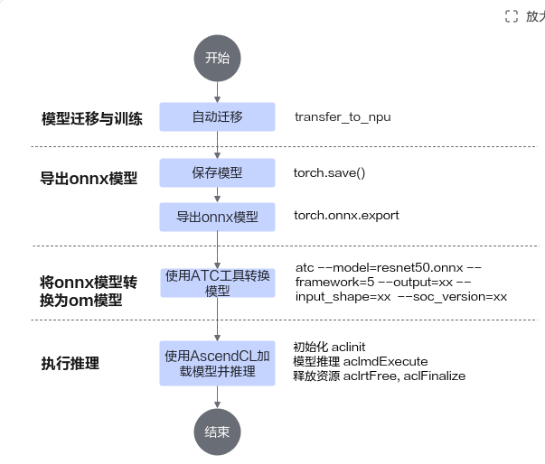

# 快速入门<a name="ZH-CN_TOPIC_0000002520772070"></a>

## 编译构建<a name="ZH-CN_TOPIC_0000002520932058"></a>

### 1. 编译依赖

|硬件依赖||
|--|:-:|
|CPU|Kunpeng-920 / Kunpeng-920B|
|Architecture|aarch64|
|内存|32GB及以上|

|软件依赖|软件版本|
|--|:-:|
|操作系统|Kunpeng-920 / Kunpeng-920B|
|CMake|3.22.0|
|GCC|10.3.1|
|JDK|1.8.0_432|

### 2. 源码编译
1. 下载源代码：
从OpenEuler开源社区下载OmniStateStore的源代码到编译服务器上；
2. 执行编译命令，以编译release包为例：

    ```
    bash scripts/build.sh -t release
    ```
    其它编译选项如下表所示，不同的编译选项可以组合使用。
    | 编译参数  | 编译选项  | 简要说明  |
    | ------------ | ------------ | ------------ |
    | -t  | debug/release  | 编译debug/release包  |
    | --ut  | -  | 编译UT测试程序  |
    | --sve  | -  | 使能鲲鹏高性能SVE指令  |
    | -h  | -  | 帮助  |
3. 检查编译成功的软件包。
编译成功则在目录dist/下存在：
OmniStateStore软件包BoostKit-omnistatestore_1.x.x_aarch64_xxx.tar.gz。

### 开发者测试
1. 执行测试运行脚本。

    ```
    sh test/run_dt.sh
    ```
2. 执行测试运行脚本后会自动编译和测试用例执行，最后观测测试用例执行结果即可。

## 环境部署<a name="ZH-CN_TOPIC_0000002520932058"></a>

环境部署参考以下链接 [installation_guide.md](docs/zh/installation_guide.md)

## 测试验证<a name="ZH-CN_TOPIC_0000002520932058"></a>

1. 进入Flink安装目录下的bin目录，并启动Flink。

    ```
    cd $FLINK_HOME/bin/ && ./start-cluster.sh
    ```

2. 调用sql-client后，进行测试。

    ```
    ./sql-client.sh
    ```

3. 在命令行中输入。

    ```
    SELECT 'Hello, Flink!';
    ```
    可以正常输出结果即安装正常。

**简介<a name="section20251624133510"></a>**

_资料书写要求：_

1. _一句话描述工具或产品的概念、功能、应用场景及解决的问题。_
2. _一句话写清楚本文档要干什么，要达成的目的。_
3. _如果是__场景或框架类产品，只描述当前快速入门是以XX为例，要做什么即可。_

示例1：

MindStudio算子开发工具包含多个工具，如msKPP、msOpGen、msOpST、msSanitizer、msDebug和msProf等，提供了多种算子功能。

示例2：

本文档以一个简单样例介绍算子开发工具应用的全流程。样例以单算子aclnn调用方式为例，介绍如何使用算子开发工具进行算子设计、算子工程创建、算子功能测试、算子异常检测、算子调试及性能调优。

示例3：

本文档通过一个简单的TensorFlow脚本迁移样例，帮助用户快速了解TensorFlow脚本迁移到昇腾平台并执行的方法。

示例4：

本文档旨在通过一个简单的样例，让开发者快速了解基于CANN进行模型迁移、训练并加载模型进行推理的大致流程。

快速入门的操作以Atlas 800 训练服务器（型号：9010）为例进行操作说明，若您使用其他型号的昇腾AI处理器，支持的功能特性及操作可能存在差异。

**使用流程（可选）<a name="section7365824193919"></a>**

_资料书写要求：_

1. _此section为可选项，如果有明确的使用流程建议配以简单的流程图和流程说明，帮助用户快速了解产品及工具使用过程。_
2. _如果快速入门比较简单，使用一个topic即可完整呈现入门内容，则不需要配以流程图。_
3. _如果可以按照topic名称输出流程，则需要在流程图中增加超链接（热点图片形式），实现一键跳转。_

示例：

使用CANN完成的深度学习任务流程如[**图 1** 流程图](#流程图)所示。

**图 1** 流程图<a name="fig1741013412222"></a><a id="流程图"></a>


**使用说明（可选）<a name="section653911462102"></a>**

_资料书写要求：_

1. _此section为可选项。_
2. _呈现工具使用的约束说明，例如：产品支持情况，权限说明，工具限制说明、版本兼容性等。_
3. _如果是快速入门中包含多种工具使用，例如MindStudio的工具链，可在此呈现每个工具的说明（一句话描述），便于用户理解。_

示例1：

该工具的产品支持情况如下表。

|产品|是否支持|
|--|:-:|
|Atlas A3 训练系列产品/Atlas A3 推理系列产品|√|
|Atlas A2 训练系列产品/Atlas 800I A2 推理产品/A200I A2 Box 异构组件|√|
|Atlas 200I/500 A2 推理产品|√|
|Atlas 推理系列产品|√|
|Atlas 训练系列产品|√|
|Atlas 200/300/500 推理产品|√|
|BS9SX2A AI处理器|√|
|AS31XM1X AI处理器|√|
|BS9SX1A AI处理器|√|
|昇腾610 AI处理器|√|
|SoC（TsnsC）|√|
|SoC（OPTG）|√|
|IPV350|x|


示例2：

在大模型推理过程中，各工具的功能说明如[**表 1** 推理工具功能说明](#推理工具功能说明)所示。

**表 1** 推理工具功能说明<a id="推理工具功能说明"></a>

|工具|功能说明|
|--|--|
|模型量化|提供模型压缩技术，通过减少模型权重、激活的数值、表示的精度来降低模型的存储和计算需求。通常会将高位浮点数转换为低位定点数，从而直接减少模型权重的体积。模型量化工具的输入为能够正常运行的模型和数据，输出为一个可以使用的量化权重和量化因子。|
|数据落盘（dump）|提供加速库模型推理过程中产生的中间数据的dump能力，落盘的数据用于进行后续的精度比对。|
|精度比对（compare）|提供一键式精度比对功能，支持快速实现推理场景的整网精度比对。|
|性能调优|采集和分析运行在昇腾AI处理器上的AI任务各个运行阶段的关键性能指标，用户可根据输出的性能数据，快速定位软、硬件性能瓶颈，提升AI任务性能分析的效率。|


**环境准备（必选）<a name="section176201755124016"></a>**

_资料书写要求：_

1. _呈现工具使用__过程中需要提前准备的内容，包括软硬件环境要求、依赖的组件及资源、权限与账号等信息。_
2. _建议以无序列表形式呈现，每条中只写一个方面，例如，第一条只写软硬件环境要求。_
3. _也可以使用表格呈现，需要根据具体的内容评估哪种呈现方式更清晰就使用哪种。_
4. _语句简单清晰，如果需要对准备的内容进行补充，可使用说明样式呈现补充或重点强调的内容。_
5. _描述环境要求，组件或依赖安装时，只描述关键信息即可，如果需要参见更详细的内容，建议给出超链接，链接到对应文档进行查阅参考。_
6. _涉及到账号密码等重要信息的高危操作要有明显的提示。_

示例1：

- 准备Atlas A2 训练系列产品/Atlas 800I A2 推理产品的服务器，并安装对应的驱动和固件，具体安装过程请参见《CANN 软件安装指南》中的“安装NPU驱动固件”章节。
- 安装Ascend-cann-toolkit，具体安装过程请参见《CANN 软件安装指南》中的“安装开发套件包”章节。
- 请参考《Ascend Extension for PyTorch 软件安装指南》安装配套的PyTorch框架、torch\_npu插件和PyTorch扩展库torchvision。

示例2：

- 准备Atlas A2 训练系列产品/Atlas 800I A2 推理产品的服务器，并安装对应的驱动和固件，具体安装过程请参见安装NPU驱动固件《CANN软件安装指南》《CANN 软件安装指南》中的“安装NPU驱动固件”章节。
- 安装Ascend-cann-toolkit，请参考安装CANN《CANN软件安装指南》《CANN 软件安装指南》中选择“训练&推理&开发调试”场景安装CANN软件包。
- 若要使用MindStudio Insight进行查看时，需要单独安装MindStudio Insight软件包，具体下载链接请参见“安装与卸载”《MindStudio Insight工具用户指南》的“安装与卸载”章节。

> **说明：** 
>-   $\{git\_clone\_path\}为sample仓的存放路径。
>-   $\{INSTALL\_DIR\}请替换为CANN软件安装后文件存储路径。以root安装举例，安装后文件默认存储路径为：/usr/local/Ascend/latest/usr/local/Ascend/ascend-toolkit/latest/x86\_64-linux。若安装的Ascend-cann-toolkit软件包，以root安装举例，则安装后文件存储路径为：/usr/local/Ascend/ascend-toolkit/latest。
>-   在安装昇腾AI处理器AI处理器SoCNPU IP加速器的服务器执行**npu-smi info**命令进行查询，获取**Chip Name**信息。实际配置值为AscendChip Name，例如**Chip Name**取值为_xxxyy_，实际配置值为Ascend_xxxyy。_当Ascendxxxyy为代码样例路径时，需要配置ascend_xxxyy_。
>-   如果需要指令占比饼图（instruction\_cycle\_consumption.html），则需要安装生成饼图所依赖的Python三方库plotly。
>    ```
>    pip3 install plotly
>    ```


## 操作步骤<a name="ZH-CN_TOPIC_0000002551892063"></a>

_资料书写要求：_

- _优先以动词加名词的形式组织关键步骤标题。如“创建MindX SDK工程”。_
- _优先使用IDP的“步骤”_。
- _如果任务执行在7个步骤内，可直接使用操作步骤1个topic即可。_
- _如果步骤较多，但是可以写在一个topic中，可根据实际情况考虑使用“section”，section的名称可以使用具体的动作，例如，创建XXX。_
- _如果1个topic中的section超过3个，或多种工具共同协同工作，则可根据工具使用情况分topic写作。__关键步骤使用topic写作的示例如[zh-cn\_topic\_0000002515486406.md](zh-cn_topic_0000002515486406.md)\~[zh-cn\_topic\_0000002419672880.md](zh-cn_topic_0000002419672880.md)所示。_
- _快速入门步骤中尽量减少不必要的链接跳转，以最简单的使用方式的维度指导用户快速使用产品。_
- _对于命令行操作，给出可直接复制的命令，需要用户自行填写或者修改的内容要给出明显提示。并附上常见的示例命令行，确保直接复制也可成功运行。_
- _针对回显信息，建议给出执行成功后的回显截图或者具体的Screen。_
- _在具体执行过程中，可合理使用“说明”给出需要注意的信息。_
- _如果在单独的操作中也有前提条件或简单介绍，可增加section，如果没有，则直接写操作步骤。_


### 编译依赖
1. 软件依赖：
- OS：openEuler20.03、openEuler22.03、openEuler24.03
- cmake：3.22.0
- GCC：10.3.1
- JDK：1.8.0_432

### 源码编译
1. 下载源代码：
从OpenEuler开源社区下载OmniStateStore的源代码到编译服务器上；
2. 执行编译命令，以编译release包为例：
    ```
    bash scripts/build.sh -t release
    ```
    其它编译选项如下表所示，不同的编译选项可以组合使用。
    | 编译参数  | 编译选项  | 简要说明  |
    | ------------ | ------------ | ------------ |
    | -t  | debug/release  | 编译debug/release包  |
    | --ut  | -  | 编译UT测试程序  |
    | --sve  | -  | 使能鲲鹏高性能SVE指令  |
    | -h  | -  | 帮助  |
3. 检查编译成功的软件包。
编译成功则在目录dist/下存在：
OmniStateStore软件包BoostKit-omnistatestore_1.x.x_aarch64_xxx.tar.gz。

### 编译依赖
1. 软件依赖：
- OS：openEuler20.03、openEuler22.03、openEuler24.03
- cmake：3.22.0
- GCC：10.3.1
- JDK：1.8.0_432


